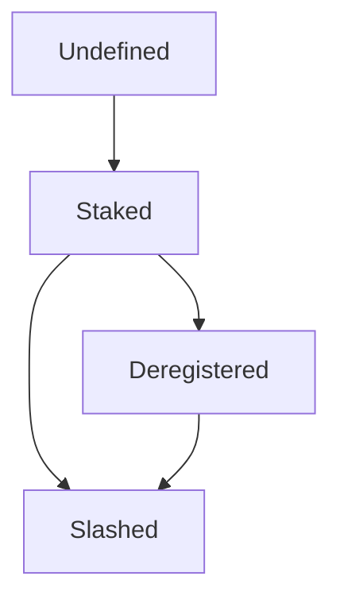

CoReputation
===

| version | Last updated | Component          |
| ------- | ------------ | ------------------ |
| 0.14    | 08/01/2020    | CoReputation |

**Meeting date/time:** N/A

**Editor:** Deepesh Kumar Nath

**Team:** N/A

---

## Overview
`CoReputation` contract on the auxiliary chain does the bookkeeping of validators. This contract on the auxiliary chain mirrors a subset of the total validator set (minimally the core validators) of the `Reputation` contract on origin. With each metablock opening cycle, an array of updated validators and their reputation synchronises the origin reputation to the coreputation contract. This contract tracks the following for validators
- Validator status
    - Undefined
    - Slashed
    - Staked
    - Deregistered
- Reputation

The reputation and the status of the validators will be updated when the opening of the kernel is confirmed on the auxiliary chain and the proposed metablock is committed on the auxiliary chain.

New validators with a non-zero reputation in the kernel become `Staked` (`Undefined -> Staked`).
Staked validators with a zero reputation in the kernel are logged out, which in coreputation is marked as `deregistered` (`Staked -> Deregistered`).
Staked validators that violate slashing conditions will be instantly marked as `Slashed` (`Any -> Slashed`)

## Goals

The goal of coreputation contract is to achieve the following
- The coreputation contract will accept the array of validators and reputation as input. This contract will store these values. This can only be called by coconsensus contract.
- If the validator does not exist in the coreputation contract then the status of the validator is considered as `Undefined`.
- The coreputation contract should update the status of the validator to `Staked` when the current status of the validator is `Undefined` and the reputation of the validator to be updated is a non-zero value.
- The coreputation contract should update the status of the validator to `Deregistered` when the current status of the validator is `Staked` and the reputation of the validator to be updated is zero value.
- The coreputation contract should allow the coconsensus contract to change the status of the validator to `Slashed`.
- The state change of the validators state can happen as follows

- This contract should provide an interface for other contracts to read the status of the validator
- This contract should provide an interface for other contracts to read the reputation of the validators
- This contract should provide an interface for other contracts to check if the validator is active or logged out.

## Assumptions

## Out of scope

## Open questions

## Approach
---
## Meeting notes
### Meeting 1
date/time:
attendees:
