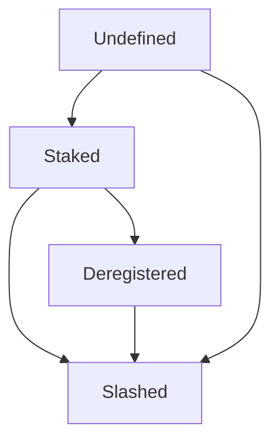

CoReputation
===

| version | Last updated | Component          |
| ------- | ------------ | ------------------ |
| 0.14    | 08/01/2020    | CoReputation |

**Meeting date/time:** N/A

**Editor:** Deepesh Kumar Nath

**Team:** N/A

---

## Overview
`CoReputation` contract on the auxiliary chain does the bookkeeping of validators. This contract on the auxiliary chain mirrors a subset of the total validator set (minimally the core validators) of the `Reputation` contract on origin. With each metablock opening cycle, an array of updated validators and their reputation synchronises the origin reputation to the coreputation contract. This contract tracks the following for validators
- Validator status
    - Undefined
    - Slashed
    - Staked
    - Deregistered
- Reputation

The reputation and the status of the validators will be updated when the opening of the kernel is confirmed on the auxiliary chain and the proposed metablock is committed on the auxiliary chain.

New validators with a non-zero reputation in the kernel become `Staked` (`Undefined -> Staked`).
Staked validators with a zero reputation in the kernel are logged out, which in coreputation is marked as `Deregistered` (`Staked -> Deregistered`).
Staked validators that violate slashing conditions will be instantly marked as `Slashed` (`Any -> Slashed`)

## User stories for Gen1-BFT

- As a CoConsensus contract, it should be able to register validators in CoReputation contract.
- As a CoConsensus contract, it should abe able to update reputation value and validator status in CoReputation contract.
    - Non existing validator default status is `Undefined`.
    - Validator status should change to `Staked` when validator status is `Undefined` and he has non zero reputation value.
    - Validator status should changed to `Deregistered` when his current status is `Staked` and reputation value changes to zero value.
- As a user, I should be able to read the status of validators.
- As a user, I should be able to read the reputation of validators.
- ~~As a user, I should be able to check if validator is active or Deregistered.~~
- As a user, I should be able to check if validator is slashed or not.
- As a CoConsensus contract, it should be able to slash a validator.

## CoReputation state machine
The state change of the validators state can happen as follows


## Tasks
(This section is temporary here, will be removed)

1. CoReputationGenesis contract
    - CoReputationGenesis is the contract that holds all the variables used in origin anchor contract.
    - This contract should not hold any logical function, this is pure storage contract containing only variables.
    - We should define `ValidatorStatus` enum. Validator values are `Undefined`, `Slashed`, `Staked`, `Deregistered`.
    - We should define `ValidatorInfo` struct. Proposed state variables in struct are below:
        - Validator status
        - reputation value
    - We should define mapping of validator address versus ValidatorInfo.
        - `mapping(address => ValidatorInfo) public validators`

<b>TO DISCUSS</b>: Since the address of the CoConsensus is provided in the genesis file, do we need coconsensus module?

2. Setup CoReputation contract(Will be updated based on discussion)
    - The CoReputation contract should inherit `CoReputationGenesis` contract.
    - The setup method is for testing purpose only. In actual case the variables of the contract will be initialized in the genesis block.
    - The CoReputation contract should follow the proxy pattern for deployment.
    - `CoReputation` is `MasterCopyNonUpgradable`, `CoConsensusModule`
    - Setup function should be called only once.
    - Proposed interface:
        ```solidity
            function setup(
                address _coConsensus,
            ) 
                external
        ```
        
 3. CoConsensus should be able to update validators information
     - CoConsensus contract should be able to add validator in CoReputation contract. Only CoConsensus should update validator information 
     - Validator reputation value should be updated. 
     - Validator status should be marked to `Staked`, if validator status is `Undefined` and he has non zero reputation value.
     - Validator status should be marked to `Deregistered` when his current status is `Staked` and reputation value changes to zero value.
     - Proposal:
         ```solidity
             function upsertValidator(
                 address _validator,
                 uint256 _reputation
             )
                 external
                 onlyCoConsensus
         ```
         
4. CoConsensus should be able to slash a validator that violate slashing conditions.
    - Only CoConsensus can call this method
    - Validator status should be `Staked`
    - Validator status should not be `Slashed`
    - Validator status should be changed to `Slashed`
    - Validator reputation should change to zero
    - Proposal:
        ```solidity
            function slash(address _validator)
                external
                onlyCoConsensus    
                hasStaked(_validator)
                hasNotSlashed(_validator)
        ```
        
5. Anyone should be able to read reputation value of a Validtaor
    - Proposal:
        ```solidity
            function getReputation(address _validator)
                external
                view
                returns (uint256)
        ```
   
## Assumptions

## Out of scope


## Open questions

## Approach
---
## Meeting notes

### Meeting 1
date/time:
attendees:

### Meeting 2
date: 10/1/2020

- `upsertValidator(uint256 reputation)`

- suggestion: CoReputation::upsertValidator() returns an enumeration value indicating if the validator should be joined, logged out, or do-nothing (for example if it was slashed in CoReputation already).

- Once slashed validator's reputation should be set to 0 both in Reputation.sol and CoReputation.sol

- suggestion: ProtoCore::isValidator() should return true with the same logic as in Core::isValidator

- note: dont write validators into `coreputationGenesis`, because we can confirm the initial kernel through the `ConsensusCogateway` and then use coconsensus to initialise the validators in coreputation and SelfProtocore. OriginAnchorGenesis has the state root at which the last validator joined on origin and the kernelOpening has been declared.

